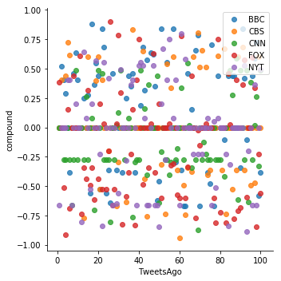

```python
# Import Twitter and Numpy Dependencies
import tweepy
import numpy as np
import matplotlib.pyplot as plt
import pandas as pd
```


```python
# Twitter API Keys
from config import (consumer_key, 
                    consumer_secret, 
                    access_token, 
                    access_token_secret)
```


```python
# Set up Tweepy Authentication
auth = tweepy.OAuthHandler(consumer_key, consumer_secret)
auth.set_access_token(access_token, access_token_secret)
api = tweepy.API(auth, parser=tweepy.parsers.JSONParser())
```


```python
# Import and Initialize Sentiment Analyzer
from vaderSentiment.vaderSentiment import SentimentIntensityAnalyzer
analyzer = SentimentIntensityAnalyzer()
```


```python
# Lists to hold sentiments
compound_list = []
positive_list = []
negative_list = []
neutral_list = []

```


```python
# Target Search Term
target_term = "@BBC"

# Lists to hold sentiments
bbc_compound_list = []
bbc_positive_list = []
bbc_negative_list = []
bbc_neutral_list = []

# Grab 100 tweets
public_tweets = api.search(target_term, count=100, result_type="recent")

# Loop through all tweets
for tweet in public_tweets["statuses"]:

    # Run Vader Analysis on each tweet
    results = analyzer.polarity_scores(tweet["text"])
    compound = results["compound"]
    pos = results["pos"]
    neu = results["neu"]
    neg = results["neg"]

    # Add each value to the appropriate array
    bbc_compound_list.append(compound)
    bbc_positive_list.append(pos)
    bbc_negative_list.append(neg)
    bbc_neutral_list.append(neu)
    
    # Add each value to the appropriate general array
    compound_list.append(compound)
    positive_list.append(pos)
    negative_list.append(neg)
    neutral_list.append(neu)

# Store the Average Sentiments
bbc_sentiment = {"Compound": np.mean(bbc_compound_list),
             "Positive": np.mean(bbc_positive_list),
             "Neutral": np.mean(bbc_negative_list),
             "Negative": np.mean(bbc_neutral_list)}    
print(len(compound_list))
```

    100


```python
# Target Search Term
target_term = "@CBS"

# Lists to hold sentiments
cbs_compound_list = []
cbs_positive_list = []
cbs_negative_list = []
cbs_neutral_list = []

# Grab 100 tweets
public_tweets = api.search(target_term, count=100, result_type="recent")

# Loop through all tweets
for tweet in public_tweets["statuses"]:

    # Run Vader Analysis on each tweet
    results = analyzer.polarity_scores(tweet["text"])
    compound = results["compound"]
    pos = results["pos"]
    neu = results["neu"]
    neg = results["neg"]

    # Add each value to the appropriate array
    cbs_compound_list.append(compound)
    cbs_positive_list.append(pos)
    cbs_negative_list.append(neg)
    cbs_neutral_list.append(neu)
    
    # Add each value to the appropriate general array
    compound_list.append(compound)
    positive_list.append(pos)
    negative_list.append(neg)
    neutral_list.append(neu)

# Store the Average Sentiments
cbs_sentiment = {"Compound": np.mean(cbs_compound_list),
             "Positive": np.mean(cbs_positive_list),
             "Neutral": np.mean(cbs_negative_list),
             "Negative": np.mean(cbs_neutral_list)}   
print(len(compound_list))
```

    200


```python


#CNN
# Target Search Term
target_term = "@CNN"

# Lists to hold sentiments
cnn_compound_list = []
cnn_positive_list = []
cnn_negative_list = []
cnn_neutral_list = []

# Grab 100 tweets
public_tweets = api.search(target_term, count=100, result_type="recent")

# Loop through all tweets
for tweet in public_tweets["statuses"]:

    # Run Vader Analysis on each tweet
    results = analyzer.polarity_scores(tweet["text"])
    compound = results["compound"]
    pos = results["pos"]
    neu = results["neu"]
    neg = results["neg"]

    # Add each value to the appropriate array
    cnn_compound_list.append(compound)
    cnn_positive_list.append(pos)
    cnn_negative_list.append(neg)
    cnn_neutral_list.append(neu)
    
    # Add each value to the appropriate general array
    compound_list.append(compound)
    positive_list.append(pos)
    negative_list.append(neg)
    neutral_list.append(neu)

# Store the Average Sentiments
cnn_sentiment = {"Compound": np.mean(cnn_compound_list),
             "Positive": np.mean(cnn_positive_list),
             "Neutral": np.mean(cnn_negative_list),
             "Negative": np.mean(cnn_neutral_list)}   
print(len(compound_list))
```

    300


```python
#FOX
# Target Search Term
target_term = "@FoxNews"

# Lists to hold sentiments
fox_compound_list = []
fox_positive_list = []
fox_negative_list = []
fox_neutral_list = []

# Grab 100 tweets
public_tweets = api.search(target_term, count=100, result_type="recent")

# Loop through all tweets
for tweet in public_tweets["statuses"]:

    # Run Vader Analysis on each tweet
    results = analyzer.polarity_scores(tweet["text"])
    compound = results["compound"]
    pos = results["pos"]
    neu = results["neu"]
    neg = results["neg"]

    # Add each value to the appropriate array
    fox_compound_list.append(compound)
    fox_positive_list.append(pos)
    fox_negative_list.append(neg)
    fox_neutral_list.append(neu)
    
    # Add each value to the appropriate general array
    compound_list.append(compound)
    positive_list.append(pos)
    negative_list.append(neg)
    neutral_list.append(neu)

# Store the Average Sentiments
fox_sentiment = {"Compound": np.mean(fox_compound_list),
             "Positive": np.mean(fox_positive_list),
             "Neutral": np.mean(fox_negative_list),
             "Negative": np.mean(fox_neutral_list)}   
```


```python
#NYT
# Target Search Term
target_term = "@nytimes"

# Lists to hold sentiments
nyt_compound_list = []
nyt_positive_list = []
nyt_negative_list = []
nyt_neutral_list = []

tweetCount = 0

# Grab 100 tweets
public_tweets = api.search(target_term, count=100, result_type="recent")

# Loop through all tweets
for tweet in public_tweets["statuses"]:
    tweetCount = tweetCount + 1
    
    #print(tweet)

    # Run Vader Analysis on each tweet
    results = analyzer.polarity_scores(tweet["text"])
    compound = results["compound"]
    pos = results["pos"]
    neu = results["neu"]
    neg = results["neg"]

    # Add each value to the appropriate array
    nyt_compound_list.append(compound)
    nyt_positive_list.append(pos)
    nyt_negative_list.append(neg)
    nyt_neutral_list.append(neu)
    
    # Add each value to the appropriate general array
    compound_list.append(compound)
    positive_list.append(pos)
    negative_list.append(neg)
    neutral_list.append(neu)

# Store the Average Sentiments
nyt_sentiment = {"Compound": np.mean(nyt_compound_list),
             "Positive": np.mean(nyt_positive_list),
             "Neutral": np.mean(nyt_negative_list),
             "Negative": np.mean(nyt_neutral_list)} 

```


```python
x_axis = []
source = []
count = 1
y = 0
while y < 5:
    while count < 101:
        x_axis.append(count)
        count = count +1
        if(y == 0):
            source.append('BBC')
        elif(y == 1):
            source.append('CBS')
        elif(y == 2):
            source.append('CNN')
        elif(y == 3):
            source.append('FOX')
        elif(y == 4):
            source.append('NYT')
    count = 1
    y = y + 1

#dictionary = {'TweetsAgo' : x_axis,
 #'BBC' : bbc_compound_list,
  #  'CBS': cbs_compound_list,
   # 'CNN': cnn_compound_list,
    #'FOX': fox_compound_list,
    #'NYT': nyt_compound_list
#}

dictionary = {'TweetsAgo' : x_axis,
 'compound' : compound_list,
'source' : source
}

dataFrame = pd.DataFrame(dictionary)
dataFrame
# this should work if the CNN block adds 100 objects to compound_list as it's supposed to
```


<div>
<style>
    .dataframe thead tr:only-child th {
        text-align: right;
    }

    .dataframe thead th {
        text-align: left;
    }

    .dataframe tbody tr th {
        vertical-align: top;
    }
</style>
<table border="1" class="dataframe">
  <thead>
    <tr style="text-align: right;">
      <th></th>
      <th>TweetsAgo</th>
      <th>compound</th>
      <th>source</th>
    </tr>
  </thead>
  <tbody>
    <tr>
      <th>0</th>
      <td>1</td>
      <td>0.0000</td>
      <td>BBC</td>
    </tr>
    <tr>
      <th>1</th>
      <td>2</td>
      <td>0.5204</td>
      <td>BBC</td>
    </tr>
    <tr>
      <th>2</th>
      <td>3</td>
      <td>0.4019</td>
      <td>BBC</td>
    </tr>
    <tr>
      <th>3</th>
      <td>4</td>
      <td>0.2924</td>
      <td>BBC</td>
    </tr>
    <tr>
      <th>4</th>
      <td>5</td>
      <td>0.0000</td>
      <td>BBC</td>
    </tr>
    <tr>
      <th>5</th>
      <td>6</td>
      <td>-0.3818</td>
      <td>BBC</td>
    </tr>
    <tr>
      <th>6</th>
      <td>7</td>
      <td>0.0000</td>
      <td>BBC</td>
    </tr>
    <tr>
      <th>7</th>
      <td>8</td>
      <td>0.4588</td>
      <td>BBC</td>
    </tr>
    <tr>
      <th>8</th>
      <td>9</td>
      <td>0.6369</td>
      <td>BBC</td>
    </tr>
    <tr>
      <th>9</th>
      <td>10</td>
      <td>0.4019</td>
      <td>BBC</td>
    </tr>
    <tr>
      <th>10</th>
      <td>11</td>
      <td>0.0000</td>
      <td>BBC</td>
    </tr>
    <tr>
      <th>11</th>
      <td>12</td>
      <td>0.0000</td>
      <td>BBC</td>
    </tr>
    <tr>
      <th>12</th>
      <td>13</td>
      <td>0.2500</td>
      <td>BBC</td>
    </tr>
    <tr>
      <th>13</th>
      <td>14</td>
      <td>0.0000</td>
      <td>BBC</td>
    </tr>
    <tr>
      <th>14</th>
      <td>15</td>
      <td>0.2732</td>
      <td>BBC</td>
    </tr>
    <tr>
      <th>15</th>
      <td>16</td>
      <td>-0.5574</td>
      <td>BBC</td>
    </tr>
    <tr>
      <th>16</th>
      <td>17</td>
      <td>0.8779</td>
      <td>BBC</td>
    </tr>
    <tr>
      <th>17</th>
      <td>18</td>
      <td>0.3612</td>
      <td>BBC</td>
    </tr>
    <tr>
      <th>18</th>
      <td>19</td>
      <td>0.5499</td>
      <td>BBC</td>
    </tr>
    <tr>
      <th>19</th>
      <td>20</td>
      <td>0.4404</td>
      <td>BBC</td>
    </tr>
    <tr>
      <th>20</th>
      <td>21</td>
      <td>-0.5267</td>
      <td>BBC</td>
    </tr>
    <tr>
      <th>21</th>
      <td>22</td>
      <td>0.8422</td>
      <td>BBC</td>
    </tr>
    <tr>
      <th>22</th>
      <td>23</td>
      <td>0.6801</td>
      <td>BBC</td>
    </tr>
    <tr>
      <th>23</th>
      <td>24</td>
      <td>-0.5574</td>
      <td>BBC</td>
    </tr>
    <tr>
      <th>24</th>
      <td>25</td>
      <td>-0.3612</td>
      <td>BBC</td>
    </tr>
    <tr>
      <th>25</th>
      <td>26</td>
      <td>-0.6440</td>
      <td>BBC</td>
    </tr>
    <tr>
      <th>26</th>
      <td>27</td>
      <td>0.4588</td>
      <td>BBC</td>
    </tr>
    <tr>
      <th>27</th>
      <td>28</td>
      <td>0.0000</td>
      <td>BBC</td>
    </tr>
    <tr>
      <th>28</th>
      <td>29</td>
      <td>-0.3612</td>
      <td>BBC</td>
    </tr>
    <tr>
      <th>29</th>
      <td>30</td>
      <td>0.0000</td>
      <td>BBC</td>
    </tr>
    <tr>
      <th>...</th>
      <td>...</td>
      <td>...</td>
      <td>...</td>
    </tr>
    <tr>
      <th>470</th>
      <td>71</td>
      <td>-0.2263</td>
      <td>NYT</td>
    </tr>
    <tr>
      <th>471</th>
      <td>72</td>
      <td>0.0000</td>
      <td>NYT</td>
    </tr>
    <tr>
      <th>472</th>
      <td>73</td>
      <td>0.0000</td>
      <td>NYT</td>
    </tr>
    <tr>
      <th>473</th>
      <td>74</td>
      <td>0.0772</td>
      <td>NYT</td>
    </tr>
    <tr>
      <th>474</th>
      <td>75</td>
      <td>0.0000</td>
      <td>NYT</td>
    </tr>
    <tr>
      <th>475</th>
      <td>76</td>
      <td>-0.6597</td>
      <td>NYT</td>
    </tr>
    <tr>
      <th>476</th>
      <td>77</td>
      <td>0.0516</td>
      <td>NYT</td>
    </tr>
    <tr>
      <th>477</th>
      <td>78</td>
      <td>-0.5106</td>
      <td>NYT</td>
    </tr>
    <tr>
      <th>478</th>
      <td>79</td>
      <td>0.0772</td>
      <td>NYT</td>
    </tr>
    <tr>
      <th>479</th>
      <td>80</td>
      <td>0.0000</td>
      <td>NYT</td>
    </tr>
    <tr>
      <th>480</th>
      <td>81</td>
      <td>0.0000</td>
      <td>NYT</td>
    </tr>
    <tr>
      <th>481</th>
      <td>82</td>
      <td>0.0000</td>
      <td>NYT</td>
    </tr>
    <tr>
      <th>482</th>
      <td>83</td>
      <td>-0.2263</td>
      <td>NYT</td>
    </tr>
    <tr>
      <th>483</th>
      <td>84</td>
      <td>-0.8402</td>
      <td>NYT</td>
    </tr>
    <tr>
      <th>484</th>
      <td>85</td>
      <td>-0.3182</td>
      <td>NYT</td>
    </tr>
    <tr>
      <th>485</th>
      <td>86</td>
      <td>0.0000</td>
      <td>NYT</td>
    </tr>
    <tr>
      <th>486</th>
      <td>87</td>
      <td>0.0000</td>
      <td>NYT</td>
    </tr>
    <tr>
      <th>487</th>
      <td>88</td>
      <td>0.0000</td>
      <td>NYT</td>
    </tr>
    <tr>
      <th>488</th>
      <td>89</td>
      <td>0.0000</td>
      <td>NYT</td>
    </tr>
    <tr>
      <th>489</th>
      <td>90</td>
      <td>0.0000</td>
      <td>NYT</td>
    </tr>
    <tr>
      <th>490</th>
      <td>91</td>
      <td>0.0000</td>
      <td>NYT</td>
    </tr>
    <tr>
      <th>491</th>
      <td>92</td>
      <td>0.5267</td>
      <td>NYT</td>
    </tr>
    <tr>
      <th>492</th>
      <td>93</td>
      <td>-0.8885</td>
      <td>NYT</td>
    </tr>
    <tr>
      <th>493</th>
      <td>94</td>
      <td>-0.2023</td>
      <td>NYT</td>
    </tr>
    <tr>
      <th>494</th>
      <td>95</td>
      <td>0.0000</td>
      <td>NYT</td>
    </tr>
    <tr>
      <th>495</th>
      <td>96</td>
      <td>-0.6597</td>
      <td>NYT</td>
    </tr>
    <tr>
      <th>496</th>
      <td>97</td>
      <td>0.3612</td>
      <td>NYT</td>
    </tr>
    <tr>
      <th>497</th>
      <td>98</td>
      <td>-0.6597</td>
      <td>NYT</td>
    </tr>
    <tr>
      <th>498</th>
      <td>99</td>
      <td>0.0000</td>
      <td>NYT</td>
    </tr>
    <tr>
      <th>499</th>
      <td>100</td>
      <td>0.4939</td>
      <td>NYT</td>
    </tr>
  </tbody>
</table>
<p>500 rows × 3 columns</p>
</div>


```python
# Store the Average Sentiments
sentiment = {"Compound": np.mean(compound_list),
             "Positive": np.mean(positive_list),
             "Neutral": np.mean(negative_list),
             "Negative": np.mean(neutral_list)}

# Print the Sentiments
print(sentiment)
```


```python
# library & dataset
import seaborn as sns
df = dataFrame

colors = ['lightcoral', 'lightskyblue', 'gold', 'red', 'green']
#size = result['driver_count'].values
#size = np.array(size, dtype=int)
# Use the 'hue' argument to provide a factor variable -- SIZE??
# Use the 'hue' argument to provide a factor variable
sns.lmplot( x="TweetsAgo", y="compound", data=df, fit_reg=False, hue='source', legend=False)


ax = plt.gca()
#ax.set_title("Pyber Ride Sharing Data")


#g.set_axis_labels("Total Number of Rides (Per City)","Average Fare $")
#plt.ylim(15, 45)
#plt.xlim(0, 40)

#g.set_axis_title('Pyber Ride Sharing Data', fontsize=20,color="r",alpha=0.5)


 
# Move the legend to an empty part of the plot
plt.legend(loc='upper right')
 
plt.show()
```





```python
g = sns.FacetGrid(df, size=8)
g.map(plt.scatter, "TweetsAgo", "BBC")
g.map(plt.scatter, "TweetsAgo", "CBS")
plt.show()
```
